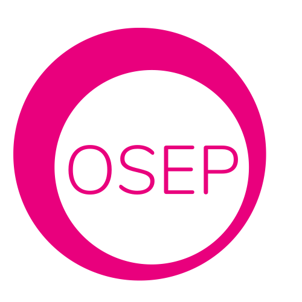

#### Open Scratch Extension Platform (OSEP)

    
    
> ## Projects & Licenses:

OSEP is a combination of multiple Github open-soucred projects including:

+ [scratch-vm](https://github.com/LLK/scratch-vm/blob/develop/LICENSE)
+ [s3-extend](https://github.com/MrYsLab/s3-extend/blob/master/LICENSE)
+ [scratch3-internet](https://github.com/gasolin/scratch3-internet/blob/master/LICENSE)
+ [my-scratch3-offline](https://github.com/t301000/my-scratch3-offline)
  
    
    
> ## Acknowledgements:  

Thanks all the developers for the kind contribution and hard work!

+ [LLK](https://github.com/LLK)
+ [Alan Yorinks](https://github.com/MrYsLab)
+ [Fred Lin](https://github.com/gasolin)
+ [Estea Chen](https://github.com/estea8968)
+ [林士立](https://github.com/t301000)
+ Justina Hsu
+ Carl Fang
+ Juh Chen
+ Morc Chiao
